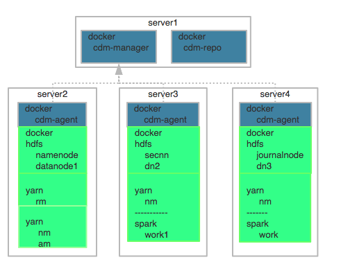

# 1. 现状与思考  

在实践大数据基础平台docker化，也遇到了一些问题，我通过下面一个比较实际的例子来谈谈。
## 1.1. 背景介绍
基础服务用docker封装。在docker之上我们用rancher来管理我们的docker集群,所有大数据组件基本用的都是apache community edition。
## 1.2 例子
### 1.2.1 hdfs docker化
在对hdfs服务进行docker化中，考虑到生产环境需要引入HA，所以需要引入failover controller node，要保证Namenode与secondary节点的通信需要引入journalnode。出于安全的考虑不能把集群所有主机都暴露出来，需要一个或者若干gateway。考虑到线上的快速恢复，也需要引入backup node。也就是说为了部署一个能够上生产的hdfs基础组件，需要部署namenode，secondary namenode，datanode，journalnode，failovercontraoller node，backup node，gateway node6个服务（完整情况下应该是8个）。借鉴对docker的最佳实践，我们一个container只部署一个服务。我们至少需要编写6个dockerfile。编写完后，我们通过docker-compose结合rancher来管理我们的服务。通过rancher 进行容器的编排。
### 1.2.2 yarn等资源调度的引入
接下来我真的引入了yarn，yarn 需要引入jobhistory，resourcemanager ,nodemanager 三个服务，对hadoop的hdfs-site，yarn-site等配置文件进行修改，我们需要对前面的dockerfile中配置文件进行一个个更改并且重新build，push，deploy。为了docker中yarn能组合上hdfs，上面过程反复开发测试，这种行为非常低效。所以借鉴IOC的想法。引入动态参数调整，就是为了应对后期大量的且频繁的调优，以及对接可能会对接的组件（eg：yarn）引起的配置参数的变更。为了应对的可能的变化，我们引入了多个shell，定义了常见的大几十个变量。编写了大量的sed替换代码。
### 1.2.3 代码盘点
后面维护的同学，仅仅俩个基础组件需要维护：6个hdfs的dockerfile，3个yarn的dockerfile，以及若干shell脚本，若干配置文件，另外要保证俩个组件组合共用的配置文件需要在多个image中保持一致
### 1.2.4 项目上线
我们通过rancher来管理我们的docker并进行服务的编排和调度。所以我们需要对所有的服务器进行针对各个组建一一进行统一的标签化，eg：hdfs定义标签hd.role.namenode=true,hd.role.datanode=true,yarn定义标yarn.role.rm=true,yarn.role.nm=true,etc。确保服务器能够争取的部署到我想要部署的服务器。思考下图dockerfile中的服务如何才能更好在docker中进行管理和部署？如果还有其他的组件呢spark,hive，hbase，kafka，zookeeper？  

## 1.3 有待完善的事情
在1.2中我们描述了一个完整组件上生产需要考虑的基础性问题。但远远不够，还需要考虑管理，运营，安全等方面的问题。先蛮罗列下几个点后续在补充
### 1.3.1 管理问题
1. 资源的统一管理
2. 多集群的管理（hadoop，kafka，zookeepr）
3. 日志统一管理和节点定位
4. 集群疾病与诊断史 
### 1.3.2 部署
1. 升级部署，不是推到重来
2. 统一的配置管理
3. 管理不同服务的启停备份
4. 多host管理（vm，物理机，docker）
5. 配置审计跟踪
6. 配置版本控制和历史记录
### 1.3.3 安全与运营
1. 针对不通组件的软件监控指标
2. 系统硬件的监控指标
3. 报警管理
4. 安全认证
5. 服务、主机和活动监控

## 1.4 小结
上面的所遇到挺多的，我抽象成俩个基本问题。
a. 通过rancher结合docker更好管理单个组件多个不通类型服务，以及满足线上要求的服务与管理运维（eg：一个hdfs完成的组建有8个（namenode，secondarynamenode，datanode，journalnode，failover controller etc）
a. 如何通过rancher集合docker更好管理多个组件多个不通类型服务组合和以及满足线上要求的服务与管理运维。  

# 2 尝试的部署架构改进  
我们用cloudera manager结合实际场景下对docker使用方式做了姿势上的调整。所以本节分为俩部分 cloudera manager（cdm）以及docker结合cdm的使用方式调整
## 2.1 cloudera manager
先来看看cdm官网提供的架构图，如下图  

上面描述了几个组件  
- Agent：安装在每台主机上。该代理负责启动和停止的过程，拆包配置，触发装置和监控主机。  
- Management Service：由一组执行各种监控，警报和报告功能角色的服务。  
- Database：存储配置和监视信息。通常情况下，多个逻辑数据库在一个或多个数据库服务器上运行。  
- Cloudera Repository：cloudera 软件包的公有源
- client
    - Admin Console - 基于Web的用户界面与管理员管理集群和Cloudera管理。
    - API - 与开发人员创建自定义的Cloudera Manager应用程序的API。

一句话总结下CDM：核心组建是Management Service，该服务承载管理控制台的Web服务器和应用程序逻辑，并负责安装软件，配置，启动和停止服务，以及管理运行群集。cdm管理management service，agent等自带的几个服务，能够完成单个组件对自生多个服务的管理。此外cdm对大数据组件的管理方式，也采用相同的方式。也就是说CDM们管理单个组件的多个服务，管理多个组件之间的服务组合（CDM的功能调研见-wiki[《cloudera manager 功能调研和功能展示》](https://wiki.finogeeks.club/pages/viewpage.action?pageId=23862334)。CDM解决**第1节**我们提到的问题。那docker又能为我们大数据平台带来什么？

## 2.2 部署架构

借助CDM的有点可以帮助我们快速搭建和管理运维多个集群。但是基础环境比如节点通信的sshd，时钟同步ntpd这些环境的准备和同步是CDM所不能做的，而docker能够保证开发-测试-生产基础环境的一致性，形成开发到上生产的全生命周期。rancher管理docker，可以快速拉起我们所要的docker节点数。来看下我们基础架构图  
  
- rancher,用于管理docker集群，快速拉起多个预先准备好基础环境的docker image
- docker，有俩个功能
    1. 准备集群所需要的基础环境，需要预先安装ntpd，sshd等服务
    2. 构建cloudera manager的安装镜像（A），cloudera软件包私有源镜像（B）。通过访问A所生成容器的服务，我们可以快速将B中的集群组件安装到第1小点所准备的服务  
- cloudera manager：见2.1
- cloudera private repo:cloudera软件包私有源镜像
- VM：虚拟机
- Physical machine：物理机  

是的你没看错，在上面的场景下，我们将docker的使用定位进行改变，提升定位到和VM，物理机一个级别。cloudera manager管理的主机资源中，只要能暴漏sshd的端口都可以是一种主机资源。依据这样的调整我们集合上面的基础架构图，尝试了如下部署架构  
  
如图，这边我们启动了8个docker，其中3个cdm-agent，3个用于部署大数据组件,1个cdm-manager安装镜像，1个cloudera软件包私有源镜像。为什么采用上面的部署架构？如果采用微服务对docker的使用方式，我们应该对部署大数据组件的docker服务进行拆分，得到的架构图如下  
  
在思考这样的架构图是否合理或者能够落地的时候，我们再去回想下我们在大数据落地**第一小结**遇到的问题。如果按这样的架构图去落地，我们也许需要做下面的几件事情  
1. 针对不同的组件服务，编写不通类型dockerfile，这里的image只是对应服务可能会用到的基础环境，比如ssh安装。
2. 针对组件间与组件内部服务通信的需要，开放特定服务所需要的端口，这对组件docker的成员的要求是提高的，需要对编写服务和其他可能存在交互的docker服务有一定了解。但是这实际上相比与1.2.1，需要对服务进行繁琐的配置，有了一定的简化。
3. 通过rancher进行服务编排，cdm根据一定的规则，将组件安装到对应的docker容器上   

通过对上面方案的推演，我们对docker的功能进行一定调整，增加了对不同服务的环境定制，将CDM在进行软件安装所自动初始化的东西，下放到docker上，最典型就是服务端口的管理。综合来说相对1中是简化了不少，相比2.1 增加了困难。  

# 3 遗留的问题
1. 在第2点，我们根据在部署上的问题，针对性提出了解决方案，解决了部署大数据组件的繁琐，和引入docker所带来的部署难度提升，解决在针对大数据组件的监控，管理等运维上的繁杂，让开发人员从大量的dockerfile中脱离，能够更加专心应对集群上的问题，和业务上的问题。但是项目的成功与否，部署架构的抗压性能是关键，所以结合docker性能优化这块是重中之重，需要进行长期探索。从本地文件系统的选择，内存参数设置，网络方式选择和参数，CPU参数设置。
2. hadoop，spark等大数据组件的服务需要常驻。也就是说docker不能运算结束后销毁。eg：client 提交任务yarn，yarn根据docker所占剩余的资源，进行任务的分配。在docker中以若干linux container的形式存在。如果抛去第三点我对docker反常规使用。社区上有人提到那docker又能给大数据平台带来哪些改变？先画个简易的数据平台业务架构图想想 
  
3. 。。。

# 附件
项目地址：
内网